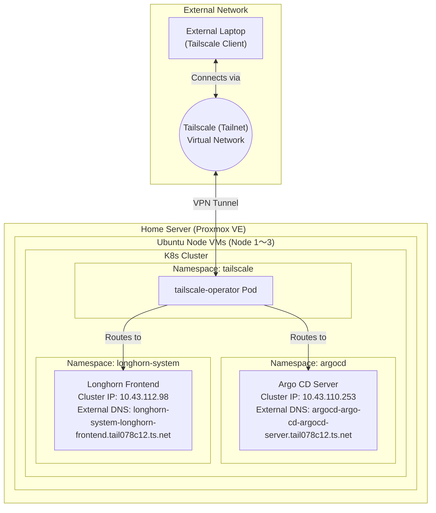
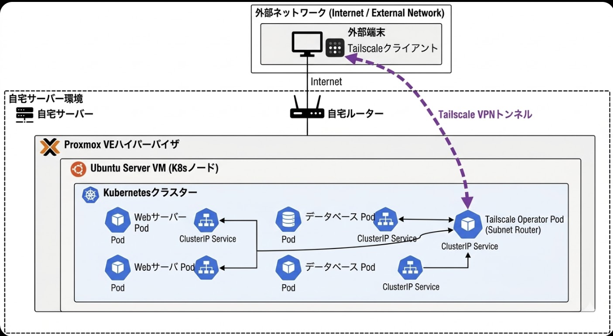

# Kubernetes Architecture

## Cluster Overview

This diagram illustrates the homelab's Kubernetes networking and infrastructure setup, including external access via Tailscale and the internal namespace structure.

## Infrastructure Details

### 1. External Access
- **Tailscale (Tailnet):** Virtual network connecting external clients to the cluster.
- **External Laptop:** Pre-configured Tailscale client.

### 2. Kubernetes Resources
- **Argo CD Server:**
  - **External DNS:** `argocd-argo-cd-argocd-server.tail078c12.ts.net`
  - **Cluster IP:** `10.43.110.253`
- **Longhorn Frontend:**
  - **External DNS:** `longhorn-system-longhorn-frontend.tail078c12.ts.net`
  - **Cluster IP:** `10.43.112.98`

### 3. Physical / VM Infrastructure
- **Proxmox Host:** `proxmox.uchibori-home.duckdns.org`
- **Ubuntu Node VMs:** IP Range `10.10.0.x`
- **K8s Service CIDR:** `10.43.0.0/16`

---

## Original Conceptual Diagram

